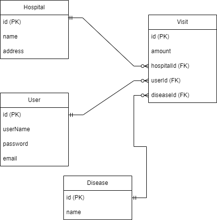

# Spring Boot & Mustache를 이용한 병원 게시판

## 🛠 Dev Tool & Stack

- IntelliJ IDEA  2022.2.3
  - Spring Boot
  - JPA 
  - Spring Security
  - Spring Security Test
  - JWT
  - Lombok
  - MySQL Driver
- MySql 8.0
- Talend API Tester

 

 

### 🧩 IE 다이어그램

---

 

 

### 💻 구현 기능

---

|   분류   |              기능              |             EndPoint              |                              ex                              |
| :------: | :----------------------------: | :-------------------------------: | :----------------------------------------------------------: |
|   회원   |            회원가입            |      POST /api/v1/users/join      |                                                              |
|          |             로그인             |     POST /api/v1/users/login      |                                                              |
|   병원   |       병원 상세정보 조회       |    GET /api/v1/hospitals/{id}     | http://ec2-3-35-227-194.ap-northeast-2.compute.amazonaws.com:8080/api/v1/hospitals/1 |
|  게시글  |          게시글 등록           |       POST /api/v1/articles       |                                                              |
|          |      게시글 상세정보 조회      |     GET /api/v1/articles/{id}     | http://ec2-3-35-227-194.ap-northeast-2.compute.amazonaws.com:8080/api/v1/articles/1 |
| 방문기록 |         방문기록 등록          |        POST /api/v1/visits        |                                                              |
|          |       전체 방문기록 조회       |        GET /api/v1/visits         | http://ec2-3-35-227-194.ap-northeast-2.compute.amazonaws.com:8080/api/v1/visits |
|          | 회원 id를 이용한 방문기록 조회 |   GET /api/v1/visits/users/{id}   | http://ec2-3-35-227-194.ap-northeast-2.compute.amazonaws.com:8080/api/v1/visits/users/1 |
|          | 병원 id를 이용한 방문기록 조회 | GET /api/v1/visits/hospitals/{id} | http://ec2-3-35-227-194.ap-northeast-2.compute.amazonaws.com:8080/api/v1/visits/hospitals/1 |

